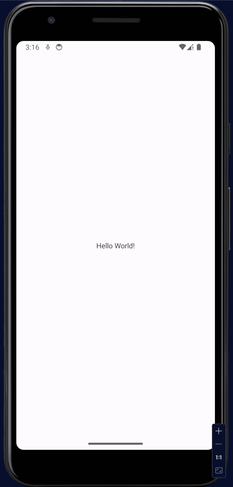

# Program for printing 'Hello World!' in Android.

**Name**: Program for printing hello world in Android.

**Date**: July 12th, 2024

## Source Code

## Java Code

```java
package com.example.myfirstapplication;

import android.os.Bundle;

import androidx.activity.EdgeToEdge;
import androidx.appcompat.app.AppCompatActivity;
import androidx.core.graphics.Insets;
import androidx.core.view.ViewCompat;
import androidx.core.view.WindowInsetsCompat;

public class MainActivity extends AppCompatActivity {

    @Override
    protected void onCreate(Bundle savedInstanceState) {
        super.onCreate(savedInstanceState);
        EdgeToEdge.enable(this);
        setContentView(R.layout.activity_main);
        ViewCompat.setOnApplyWindowInsetsListener(findViewById(R.id.main), (v, insets) -> {
            Insets systemBars = insets.getInsets(WindowInsetsCompat.Type.systemBars());
            v.setPadding(systemBars.left, systemBars.top, systemBars.right, systemBars.bottom);
            return insets;
        });
    }
}
```

## XML Code

```xml
<?xml version="1.0" encoding="utf-8"?>
<androidx.constraintlayout.widget.ConstraintLayout 
    xmlns:android="http://schemas.android.com/apk/res/android"
    xmlns:app="http://schemas.android.com/apk/res-auto"
    xmlns:tools="http://schemas.android.com/tools"
    android:id="@+id/main"
    android:layout_width="match_parent"
    android:layout_height="match_parent"
    tools:context=".MainActivity">

    <TextView
        android:layout_width="wrap_content"
        android:layout_height="wrap_content"
        android:text="Hello World!"
        app:layout_constraintBottom_toBottomOf="parent"
        app:layout_constraintEnd_toEndOf="parent"
        app:layout_constraintStart_toStartOf="parent"
        app:layout_constraintTop_toTopOf="parent" />

</androidx.constraintlayout.widget.ConstraintLayout>
```

## Output


