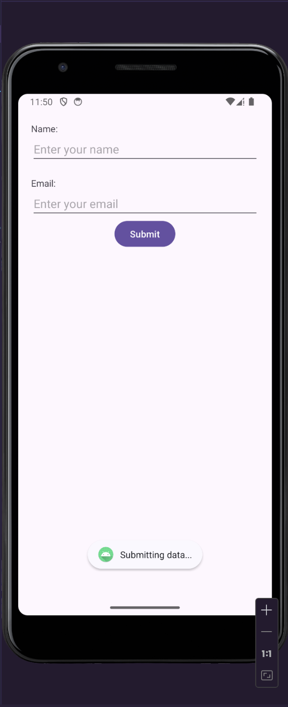

# Program for printing a simple user interface of a login page.

**Name**: Program for  printing a simple user interface of a login page.

**Date**: September 1st, 2024

## Source Code

## MainActivity.java Code

```java
package com.example.simpleuserinterface;

import android.os.Bundle;

import android.view.View;
import android.widget.Toast;
import androidx.activity.EdgeToEdge;
import androidx.appcompat.app.AppCompatActivity;
import androidx.core.graphics.Insets;
import androidx.core.view.ViewCompat;
import androidx.core.view.WindowInsetsCompat;

public class MainActivity extends AppCompatActivity {
    public void Submit(View view){
        Toast.makeText(this, "Submitting data...", Toast.LENGTH_SHORT).show();
    }
    @Override
    protected void onCreate(Bundle savedInstanceState) {
        super.onCreate(savedInstanceState);
        EdgeToEdge.enable(this);
        setContentView(R.layout.activity_main);
        ViewCompat.setOnApplyWindowInsetsListener(findViewById(R.id.main), (v, insets) -> {
            Insets systemBars = insets.getInsets(WindowInsetsCompat.Type.systemBars());
            v.setPadding(systemBars.left, systemBars.top, systemBars.right, systemBars.bottom);
            return insets;
        });
    }
}
```

## XML Code

```xml
<?xml version="1.0" encoding="utf-8"?>
<LinearLayout
    xmlns:android="http://schemas.android.com/apk/res/android"
    xmlns:app="http://schemas.android.com/apk/res-auto"
    xmlns:tools="http://schemas.android.com/tools"
    android:layout_width="match_parent"
    android:layout_height="match_parent"
    android:orientation="vertical"
    tools:context=".MainActivity"
    android:id="@+id/main">

    <TextView
        android:layout_width="wrap_content"
        android:layout_height="wrap_content"
        android:text="Name:"
        android:layout_marginTop="20dp"
        android:layout_marginStart="20dp" />

    <EditText
        android:layout_width="match_parent"
        android:layout_height="wrap_content"
        android:layout_marginStart="20dp"
        android:layout_marginEnd="20dp"
        android:hint="Enter your name" />

    <TextView
        android:layout_width="wrap_content"
        android:layout_height="wrap_content"
        android:text="Email:"
        android:layout_marginTop="20dp"
        android:layout_marginStart="20dp" />

    <EditText
        android:layout_width="match_parent"
        android:layout_height="wrap_content"
        android:layout_marginStart="20dp"
        android:layout_marginEnd="20dp"
        android:hint="Enter your email" />

    <Button
        android:layout_width="wrap_content"
        android:layout_height="wrap_content"
        android:text="Submit"
        android:onClick="Submit"
        android:layout_gravity="center" />
</LinearLayout>
```

## Strings Resource Code

```strings
<resources>
    <string name="app_name">Simple User interface</string>
</resources>
```

## Output


