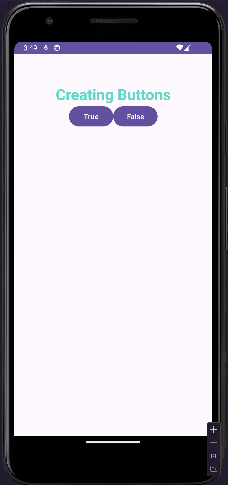
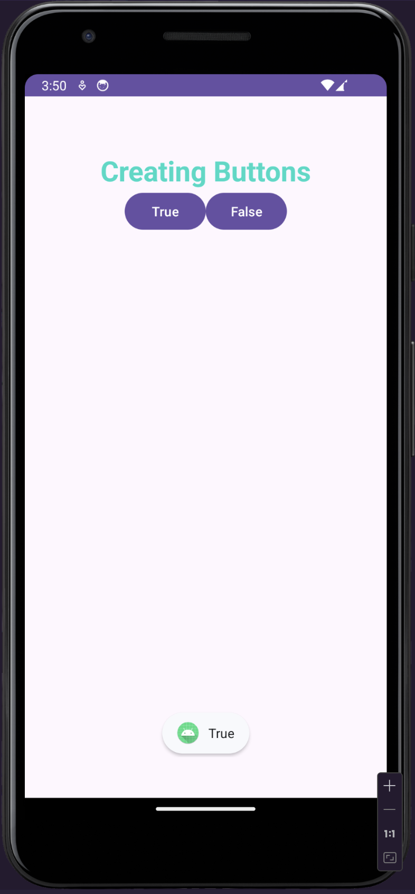
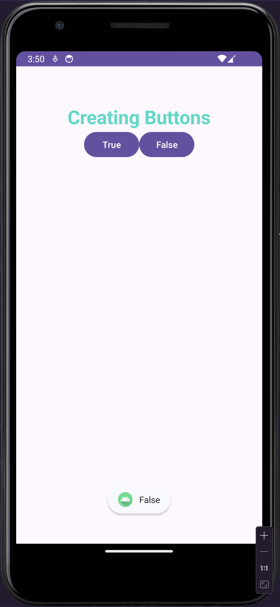

# Program for using Linear Layout with Toast method for displaying name after clicking it.

**Name**: Program for using Linear Layout with Toast method for displaying name after clicking it.

**Date**: August 9th, 2024

## Source Code

## MainActivity.java Code

```java
package com.example.linearlayout;

import android.os.Bundle;

import android.view.View;
import android.widget.Toast;

import androidx.appcompat.app.AppCompatActivity;
import androidx.core.graphics.Insets;
import androidx.core.view.ViewCompat;
import androidx.core.view.WindowInsetsCompat;

public class MainActivity extends AppCompatActivity {
    public void True(View view){
        Toast.makeText(this, "True", Toast.LENGTH_SHORT).show();
    }
    public void False(View view){
        Toast.makeText(this, "False", Toast.LENGTH_SHORT).show();
    }
    @Override
    protected void onCreate(Bundle savedInstanceState) {

        super.onCreate(savedInstanceState);
        setContentView(R.layout.activity_main);
        ViewCompat.setOnApplyWindowInsetsListener(findViewById(R.id.tvid), (v, insets) -> {
            Insets systemBars = insets.getInsets(WindowInsetsCompat.Type.systemBars());
            v.setPadding(systemBars.left, systemBars.top, systemBars.right, systemBars.bottom);
            return insets;
        });
    }
}
```

## XMl Code

```xml
<?xml version="1.0" encoding="utf-8"?>
<LinearLayout
    xmlns:android="http://schemas.android.com/apk/res/android"
    xmlns:app="http://schemas.android.com/apk/res-auto"
    xmlns:tools="http://schemas.android.com/tools"
    android:layout_width="match_parent"
    android:layout_height="match_parent"
    android:orientation="vertical" tools:context=".MainActivity">
    <TextView
        android:id="@+id/tvid"
        android:layout_width="match_parent"
        android:layout_height="wrap_content"
        android:text="Creating Buttons"
        android:textSize="30sp"
        android:textStyle="bold"
        android:textColor="#FF03DAC5"
        android:gravity="center"
        android:layout_marginTop="60dp"
        />
    <LinearLayout
        android:orientation="horizontal"
        android:layout_width="wrap_content"
        android:layout_height="wrap_content"
        android:layout_gravity="center"
    >
    <Button
        android:id="@+id/btn1"
        android:layout_width="wrap_content"
        android:layout_height="wrap_content"
        android:gravity="center"
        android:onClick="True"
        android:text="@string/true_id"
        />
    <Button
        android:id="@+id/btn2"
        android:layout_width="wrap_content"
        android:layout_height="wrap_content"
        android:gravity="center"
        android:onClick="False"
        android:text="@string/false_id"

        />
</LinearLayout>
</LinearLayout>
```

## Strings.Xml File

```xml
<resources>
    <string name="app_name">Linear Layout</string>
    <string name="true_id">True</string>
    <string name="false_id">False</string>
</resources>
```

## Output



## After Clicking True button



## After Clicking False button


